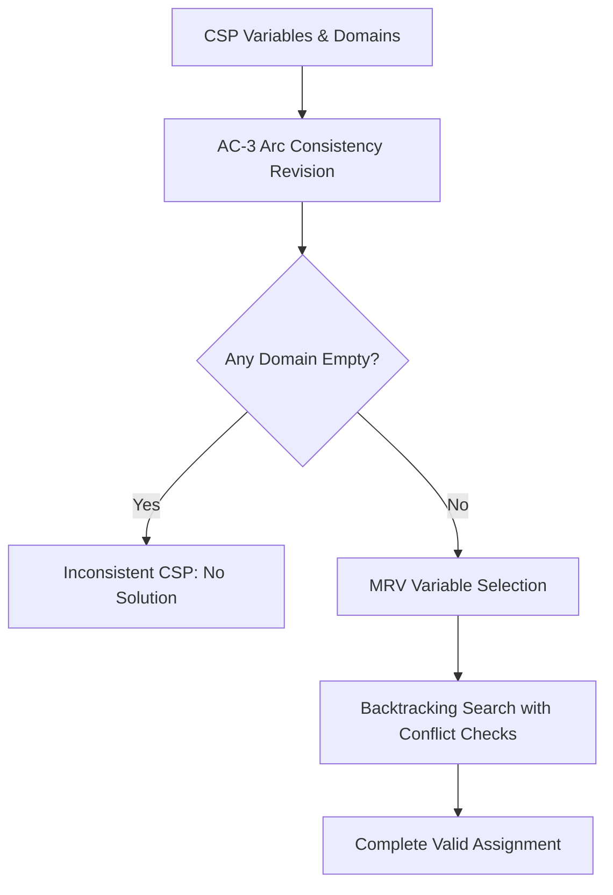

# GenPark Constraint Satisfaction AC-3 Backtracking Skill

Constraint Satisfaction Problem (CSP) solver implementing Arc Consistency AC-3 and Minimum Remaining Values (MRV) search.

Read more at [GenPark](https://genpark.ai) and the [GenPark MCP Catalog](https://genpark.ai/mcp).

## Features
- AC-3 binary constraint domain pruning.
- Minimum Remaining Values (MRV) variable selection heuristic.
- Pure Python standard library.
